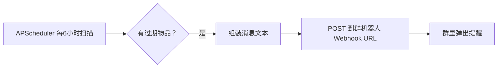
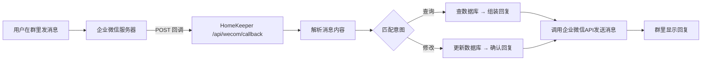

# 企业微信对接规划

> 将过期物品提醒推送到企业微信群；后续支持群内自然语言交互（查询/修改数据）。

---

## 一、对接目标

| 阶段 | 功能 | 状态 |
|------|------|------|
| **P0** | 过期物品提醒推送到企业微信群 | 🎯 规划中 |
| **P1** | 群内自然语言查询（「冰箱里有什么」「牛奶什么时候过期」）| 📋 待评估 |
| **P2** | 群内自然语言修改（「牛奶已喝完」「螺丝刀借给张三」）| 📋 待评估 |

---

## 二、前置条件（需要你那边做）

### 企业微信注册
- 已有企业微信账号（你已确认有）

### 自建应用配置
在企业微信后台完成以下步骤：

1. **创建自建应用**
   - 企业微信管理后台 → 应用管理 → 自建 → 创建应用
   - 设置应用名称（如「物管家」）、应用 Logo

2. **获取凭证（三个值）**
   ```text
   CorpID  — 企业ID（管理后台 → 我的企业 → 企业信息）
   AgentID — 应用ID（应用管理 → 自建应用详情页）
   Secret  — 应用密钥（应用详情页 → 查看 Secret）
   ```

3. **配置回调 URL**（P1 阶段需要）
   - 应用管理 → 自建应用 → 接收消息 → 设置 URL
   - URL 格式：`https://你的域名/api/wecom/callback`
   - 需要生成 Token 和 EncodingAESKey

4. **配置可信 IP**
   - 应用管理 → 自建应用 → 企业可信 IP
   - 填入你的 HomeKeeper 服务器公网 IP

---

## 三、对接方案

### P0：群机器人推送

利用企业微信群机器人的 webhook 能力，HomeKeeper 在过期扫描时 POST 消息到指定 URL。



**消息格式示例（企业微信 Markdown）：**

```
📦 **物管家 · 过期提醒**
━━━━━━━━━━━━━━━━━━
**牛奶** — 还有 2 天过期
位置：储物间 > 货架A
━━━━━━━━━━━━━━━━━━
**鸡蛋** — 还有 5 天过期
位置：冰箱
━━━━━━━━━━━━━━━━━━
⏰ 共 2 件物品即将过期
```

**API 调用示例：**

```bash
curl -X POST https://qyapi.weixin.qq.com/cgi-bin/webhook/send?key=xxx \
  -H "Content-Type: application/json" \
  -d '{
    "msgtype": "markdown",
    "markdown": {
      "content": "📦 **物管家 · 过期提醒**\n━━━━━━━━━━━━━━━━━━\n**牛奶** — 还有 2 天过期"
    }
  }'
```

### P1 / P2：自建应用回调（双向交互）



**支持的自然语言指令（示例）：**

| 群友发送 | HomeKeeper 执行 |
|---------|----------------|
| `牛奶什么时候过期` | 查数据库 → 回复「牛奶 2026-08-15 过期，还剩 16 天」|
| `冰箱里有什么` | 查位置=冰箱的物品 → 列出清单 |
| `牛奶已喝完` | 牛奶状态改为「已丢弃」|
| `买了箱苹果，下周过期` | 新增物品「苹果」→ 设保质期为 7 天后 |
| `螺丝刀借给张三了` | 螺丝刀状态改为「已借出」|
| `过期提醒改成提前5天` | 修改用户的过期提醒阈值 |

---

## 四、HomeKeeper 代码改动

| 阶段 | 改动 | 文件 |
|------|------|------|
| P0 | 配置项 + Webhook 推送 | `app/config.py` / `.env.example` / `app/routers/push.py` |
| P0 | 消息文案格式化 | `app/routers/push.py` |
| P1 | 企业微信回调模块 | `app/routers/wecom.py`（新建）|
| P1 | 消息解析引擎 | `app/services/nlp.py`（新建，预留）|
| P1 | 指令 → SQL 映射 | `app/services/wecom_handler.py`（新建）|
| P2 | 自然语言意图识别 | `app/services/nlp.py`（扩展）|

### P0 改动量（最小）

仅需修改现有 `push.py`，在 `_send_push()` 中增加一个分支：

```python
# app/routers/push.py（示意）
if settings.wecom_webhook_url:
    requests.post(settings.wecom_webhook_url, json={...})
```

无需新建模块，无需新端点。

---

## 五、与现有系统的关系

```
现有架构
  APScheduler → _check_all_users() → _send_push()
                                      ├── Web Push（保留）
                                      └── 企业微信 Webhook（新增）

现有文档
  01-功能说明.md ← 本文件被 README 索引
  05-开发指南.md ← 增加「外部服务集成」小节
  README.md     ← 导航表增加本文件链接
```

**不会影响现有功能**：Web Push 推送继续正常运作，企业微信推送是额外通道。

---

## 六、实施顺序

```
P0（1-2天）  ── 企业微信 Webhook 推送
  │
P1（3-5天）  ── 回调接收 + 自然语言查询
  │
P2（3-5天）  ── 自然语言修改 + 多群管理
```

---

## 七、风险与限制

| 风险 | 说明 | 缓解措施 |
|------|------|---------|
| 企业微信 API 频率限制 | 每分钟调用有限制 | 消息合并发送，单条包含所有过期物品 |
| 回调 URL 需公网可达 | HomeKeeper 需有公网 IP 或内网穿透 | P0 不依赖回调，P1 需要时可用 frp/Cloudflare Tunnel |
| 自然语言准确率 | 非结构化文本解析可能有误 | P1 阶段先用关键词匹配，P2 再上更复杂的解析 |
